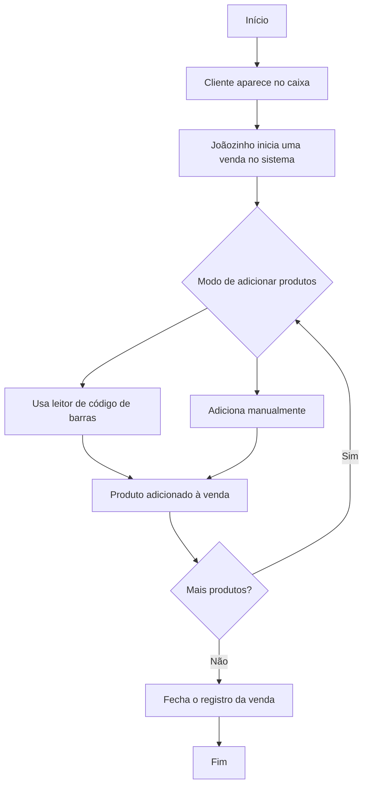

```mermaid
flowchart TD
    A[Início] --> B[Cliente aparece no caixa]
    B --> C[Joãozinho inicia uma venda no sistema]
    C --> D{Modo de adicionar produtos}
    D --> E[Usa leitor de código de barras]
    D --> F[Adiciona manualmente]
    E --> G[Produto adicionado à venda]
    F --> G
    G --> H{Mais produtos?}
    H -- Sim --> D
    H -- Não --> I[Fecha o registro da venda]
    I --> J[Fim]

```
